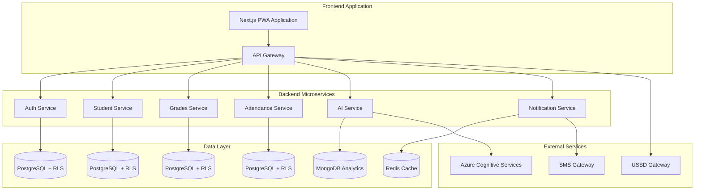

# AI Implementation Guide: Multi-Tenant School Management System for Africa

## Overview for AI Models

You are building a comprehensive, cost-efficient, multi-tenant school management system optimized for African educational markets. This system must support offline functionality, low-bandwidth environments, and provide AI-powered features while maintaining strict security and tenant isolation. the back end codebase is also in this same workspace.

---

## 1. Technology Stack Requirements (MANDATORY)

### 1.1 Frontend Stack
- **Framework**: Next.js 15 with React 18 and TypeScript (strict mode)
- **UI Library**: TailwindCSS with shadcn/ui components
- **State Management**: React Query (server state) + Zustand (client state)
- **PWA**: Service workers for offline functionality
- **Build**: Progressive Web App with background sync

### 1.2 Backend Stack  
- **Framework**: NestJS with microservices architecture
- **Database**: PostgreSQL with Row-Level Security (RLS) for multi-tenancy
- **ORM**: TypeORM with proper tenant isolation
- **Authentication**: JWT with RBAC and httpOnly cookies
- **Documentation**: Swagger/OpenAPI for all endpoints

### 1.3 Infrastructure
- **Deployment**: Docker multi-stage builds with Kubernetes/Helm
- **Caching**: Redis for sessions and MongoDB for analytics
- **CDN**: CloudFront for global delivery
- **AI Services**: Azure Cognitive Services for automated grading and voice recognition

---

## 2. Multi-Tenancy Architecture (CRITICAL)

### 2.1 Database Schema Requirements

**MANDATORY**: Every table MUST include `school_id` for tenant isolation:

```sql
-- Example tenant-aware table structure
CREATE TABLE students (
  id UUID PRIMARY KEY DEFAULT gen_random_uuid(),
  school_id UUID NOT NULL REFERENCES schools(id),
  student_number VARCHAR(50) NOT NULL,
  first_name VARCHAR(100) NOT NULL,
  last_name VARCHAR(100) NOT NULL,
  grade_level VARCHAR(20),
  enrollment_date DATE DEFAULT CURRENT_DATE,
  contact_info JSONB,
  created_at TIMESTAMP DEFAULT NOW(),
  updated_at TIMESTAMP DEFAULT NOW(),
  
  UNIQUE(school_id, student_number)
);

-- Enable Row-Level Security
ALTER TABLE students ENABLE ROW LEVEL SECURITY;

-- Create RLS policy
CREATE POLICY tenant_isolation ON students
  USING (school_id = current_setting('app.current_school_id')::UUID);
```

### 2.2 Backend Service Implementation

```typescript
// Example NestJS controller with tenant isolation
@Controller('api/v1/students')
@UseGuards(JwtAuthGuard, RolesGuard)
@ApiTags('Students')
export class StudentsController {
  constructor(private readonly studentsService: StudentsService) {}

  @Get()
  @Roles('teacher', 'admin')
  @ApiOperation({ summary: 'Get all students for current school' })
  async findAll(@Req() req: Request): Promise<Student[]> {
    const schoolId = req.user.schoolId;
    return this.studentsService.findAllBySchool(schoolId);
  }

  @Post()
  @Roles('admin')
  async create(
    @Body() createStudentDto: CreateStudentDto,
    @Req() req: Request
  ): Promise<Student> {
    return this.studentsService.create({
      ...createStudentDto,
      schoolId: req.user.schoolId
    });
  }
}
```

---

## 3. System Architecture Overview

### 3.1 Microservices Structure



### 3.2 Service Boundaries
- **Auth Service**: User authentication, authorization, tenant management
- **Student Service**: Student profiles, enrollment, academic records
- **Grades Service**: Assessment management, grade calculations, transcripts
- **Attendance Service**: Daily attendance, absence tracking, reports
- **AI Service**: Automated grading, predictive analytics, voice recognition
- **Notification Service**: Email, SMS, push notifications, USSD integration

---

## 4. Core Features Implementation

### 4.1 Authentication Module

```typescript
// Backend authentication service
@Injectable()
export class AuthService {
  async login(loginDto: LoginDto): Promise<AuthResponse> {
    // 1. Validate credentials
    // 2. Check user's school association
    // 3. Generate JWT with school_id claim
    // 4. Set httpOnly cookies for security
    // 5. Return user data and permissions
  }

  async validateSchoolAccess(userId: string, schoolId: string): Promise<boolean> {
    // Verify user belongs to the specified school
    return this.userRepository.exists({
      where: { id: userId, schoolId }
    });
  }
}
```

```typescript
// Frontend authentication hook
export const useAuth = () => {
  const login = useMutation({
    mutationFn: async (credentials: LoginCredentials) => {
      const response = await api.post('/auth/login', credentials);
      return response.data;
    },
    onSuccess: (data) => {
      useAuthStore.getState().setUser(data.user);
      useAuthStore.getState().setSchool(data.school);
    }
  });

  return { login };
};
```

### 4.2 Student Management

```typescript
// Frontend student list component
export const StudentsList: React.FC = () => {
  const { data: students, isLoading, error } = useQuery({
    queryKey: ['students'],
    queryFn: () => api.get('/students').then(res => res.data)
  });

  if (isLoading) return <StudentsSkeleton />;
  if (error) return <ErrorMessage error={error} />;

  return (
    <div className="space-y-4">
      <StudentFilters />
      <DataTable
        data={students}
        columns={studentColumns}
        searchPlaceholder="Search students..."
      />
    </div>
  );
};
```

### 4.3 Grades Management Schema

```sql
CREATE TABLE grades (
  id UUID PRIMARY KEY DEFAULT gen_random_uuid(),
  school_id UUID NOT NULL REFERENCES schools(id),
  student_id UUID NOT NULL REFERENCES students(id),
  subject_id UUID NOT NULL REFERENCES subjects(id),
  teacher_id UUID NOT NULL REFERENCES users(id),
  assessment_type VARCHAR(50) NOT NULL, -- 'exam', 'assignment', 'quiz'
  score DECIMAL(5,2) NOT NULL CHECK (score >= 0 AND score <= 100),
  max_score DECIMAL(5,2) NOT NULL DEFAULT 100,
  assessment_date DATE NOT NULL,
  term VARCHAR(20) NOT NULL,
  academic_year VARCHAR(10) NOT NULL,
  comments TEXT,
  created_at TIMESTAMP DEFAULT NOW(),
  updated_at TIMESTAMP DEFAULT NOW()
);

ALTER TABLE grades ENABLE ROW LEVEL SECURITY;
CREATE POLICY grades_tenant_isolation ON grades
  USING (school_id = current_setting('app.current_school_id')::UUID);
```

---

## 5. Progressive Web App (PWA) Implementation

### 5.1 Service Worker Configuration

```javascript
// public/sw.js - Advanced Service Worker for offline functionality
const CACHE_NAME = 'school-sms-v1';
const STATIC_CACHE = 'static-v1';
const DYNAMIC_CACHE = 'dynamic-v1';

// Critical resources to cache immediately
const STATIC_ASSETS = [
  '/',
  '/manifest.json',
  '/offline',
  '/static/css/main.css',
  '/static/js/main.js'
];

self.addEventListener('install', (event) => {
  event.waitUntil(
    caches.open(STATIC_CACHE)
      .then(cache => cache.addAll(STATIC_ASSETS))
  );
});

// Background sync for offline data
self.addEventListener('sync', (event) => {
  if (event.tag === 'background-sync') {
    event.waitUntil(syncOfflineData());
  }
});

async function syncOfflineData() {
  // Sync pending attendance, grades, and other offline changes
  const offlineStore = await idb.open('offline-store', 1);
  const pendingData = await offlineStore.getAll('pending');
  
  for (const item of pendingData) {
    try {
      await fetch(item.url, {
        method: item.method,
        body: JSON.stringify(item.data),
        headers: { 'Content-Type': 'application/json' }
      });
      await offlineStore.delete('pending', item.id);
    } catch (error) {
      console.log('Sync failed for:', item.id);
    }
  }
}
```

### 5.2 Offline Data Management

```typescript
// lib/offline-manager.ts
class OfflineManager {
  private db: IDBDatabase;

  async init() {
    this.db = await idb.open('school-sms-offline', 1, {
      upgrade(db) {
        db.createObjectStore('students', { keyPath: 'id' });
        db.createObjectStore('grades', { keyPath: 'id' });
        db.createObjectStore('attendance', { keyPath: 'id' });
        db.createObjectStore('pending-sync', { keyPath: 'id', autoIncrement: true });
      }
    });
  }

  async cacheStudents(students: Student[]) {
    const tx = this.db.transaction('students', 'readwrite');
    for (const student of students) {
      await tx.store.put(student);
    }
  }

  async queueForSync(action: OfflineAction) {
    await this.db.add('pending-sync', {
      ...action,
      timestamp: Date.now()
    });
    
    // Attempt background sync
    if ('serviceWorker' in navigator && 'sync' in window.ServiceWorkerRegistration.prototype) {
      const registration = await navigator.serviceWorker.ready;
      await registration.sync.register('background-sync');
    }
  }
}
```

---

## 6. AI Features Implementation

### 6.1 Automated Grading System

```typescript
// ai.service.ts - Automated essay grading
@Injectable()
export class AIService {
  constructor(
    @Inject('AZURE_COGNITIVE_CLIENT') 
    private cognitiveClient: CognitiveServicesClient
  ) {}

  async gradeEssay(submission: string, rubric: GradingRubric): Promise<GradingResult> {
    // Text analysis using Azure Cognitive Services
    const textAnalysis = await this.cognitiveClient.analyzeText(submission, {
      features: ['sentiment', 'keyPhrases', 'language', 'readability']
    });

    // Content evaluation against rubric
    const contentScore = await this.evaluateContent(submission, rubric);
    
    // Grammar and structure analysis
    const grammarScore = await this.analyzeGrammar(submission);
    
    // Generate comprehensive feedback
    const feedback = await this.generateFeedback(textAnalysis, contentScore, grammarScore);
    
    return {
      totalScore: this.calculateFinalScore(contentScore, grammarScore),
      breakdown: {
        content: contentScore,
        grammar: grammarScore,
        structure: textAnalysis.readability
      },
      feedback,
      suggestions: await this.generateImprovementSuggestions(submission, rubric)
    };
  }

  async predictStudentPerformance(studentId: string): Promise<PerformancePrediction> {
    // Gather historical data
    const historicalGrades = await this.getStudentGrades(studentId);
    const attendanceData = await this.getAttendanceHistory(studentId);
    const assignmentSubmissions = await this.getSubmissionHistory(studentId);
    
    // Feature engineering for ML model
    const features = this.extractPredictiveFeatures({
      grades: historicalGrades,
      attendance: attendanceData,
      submissions: assignmentSubmissions
    });
    
    // ML prediction using Azure ML
    const prediction = await this.performPrediction(features);
    
    return {
      predictedGrade: prediction.grade,
      confidence: prediction.confidence,
      riskLevel: this.calculateRiskLevel(prediction),
      interventions: await this.recommendInterventions(prediction, features),
      trendAnalysis: this.analyzeTrends(historicalGrades)
    };
  }
}
```

### 6.2 Voice-Based Attendance

```typescript
// voice-attendance.service.ts
@Injectable()
export class VoiceAttendanceService {
  async processVoiceAttendance(audioBlob: Blob, classId: string): Promise<AttendanceResult[]> {
    // Convert speech to text using Azure Speech Services
    const transcription = await this.cognitiveClient.speechToText(audioBlob, {
      language: 'en-US', // Support multiple African languages
      profanityFilter: false,
      wordTimestamps: true
    });

    // Extract student names from transcription using NLP
    const studentNames = await this.extractStudentNames(transcription.text);
    
    // Match names with enrolled students
    const classStudents = await this.getClassStudents(classId);
    const attendanceMarks = await this.matchNamesToStudents(studentNames, classStudents);
    
    // Save attendance records with tenant isolation
    const results = await this.markAttendance(attendanceMarks, classId);
    
    return results;
  }

  private async extractStudentNames(text: string): Promise<string[]> {
    // Use NLP to extract proper names
    const nameExtractionResult = await this.cognitiveClient.extractEntities(text, {
      entityTypes: ['Person']
    });
    
    return nameExtractionResult.entities
      .filter(entity => entity.type === 'Person')
      .map(entity => entity.text);
  }
}
```

---

## 7. African Market Adaptations

### 7.1 Multi-Language Support

```typescript
// lib/i18n.ts
export const supportedLanguages = {
  'en': 'English',
  'sw': 'Kiswahili',
  'fr': 'Français', 
  'ar': 'العربية',
  'am': 'አማርኛ',
  'ha': 'Hausa',
  'ig': 'Igbo',
  'yo': 'Yorùbá',
  'zu': 'isiZulu',
  'af': 'Afrikaans'
} as const;

// Cultural adaptations by country
export const culturalAdaptations = {
  'nigeria': {
    gradingSystem: '6-3-3-4',
    educationLevels: ['Primary', 'Junior Secondary', 'Senior Secondary'],
    termSystem: ['First Term', 'Second Term', 'Third Term'],
    holidays: ['Eid al-Fitr', 'Christmas', 'Independence Day']
  },
  'kenya': {
    gradingSystem: '8-4-4',
    educationLevels: ['Primary', 'Secondary'],
    termSystem: ['Term 1', 'Term 2', 'Term 3'],
    holidays: ['Eid al-Fitr', 'Christmas', 'Jamhuri Day']
  },
  'south_africa': {
    gradingSystem: 'CAPS',
    educationLevels: ['Foundation Phase', 'Intermediate Phase', 'Senior Phase', 'FET Phase'],
    termSystem: ['Term 1', 'Term 2', 'Term 3', 'Term 4'],
    holidays: ['Heritage Day', 'Freedom Day', 'Youth Day']
  }
};
```

### 7.2 USSD Integration

```typescript
// ussd.service.ts - Basic phone access via USSD
<!-- @Injectable()
export class USSDService {
  private menuStructure = {
    '*123#': {
      text: 'Welcome to School SMS\n1. Check Grades\n2. Attendance\n3. Fee Balance\n4. Messages\n9. Help',
      requiresResponse: true
    },
    '*123*1#': {
      text: 'Recent Grades:',
      handler: 'getGrades'
    },
    '*123*2#': {
      text: 'Attendance Status:',
      handler: 'getAttendance'
    }
  };

  async handleUSSDRequest(phoneNumber: string, ussdCode: string, sessionId: string): Promise<USSDResponse> {
    // Identify user by phone number
    const user = await this.findUserByPhone(phoneNumber);
    if (!user) {
      return { text: 'Phone number not registered. Contact your school.', endSession: true };
    }

    // Route to appropriate handler
    const menu = this.menuStructure[ussdCode];
    if (menu.handler) {
      return await this[menu.handler](user);
    }

    return { text: menu.text, endSession: !menu.requiresResponse };
  }

  private async getGrades(user: User): Promise<USSDResponse> {
    const grades = await this.gradesService.getRecentGrades(user.id, 3);
    const gradeText = grades
      .map(g => `${g.subject}: ${g.score}%`)
      .join('\n');
    
    return {
      text: `Recent Grades:\n${gradeText}\n\n0. Back\n9. Main Menu`,
      endSession: false
    };
  }
} -->
```

---

## 8. Low-Bandwidth Optimization

### 8.1 Adaptive UI Components

```typescript
// hooks/useNetworkStatus.ts
export const useNetworkStatus = () => {
  const [connectionQuality, setConnectionQuality] = useState<'excellent' | 'good' | 'poor' | 'offline'>('good');
  const [isLowBandwidth, setIsLowBandwidth] = useState(false);

  useEffect(() => {
    const connection = (navigator as any).connection || (navigator as any).mozConnection || (navigator as any).webkitConnection;
    
    if (connection) {
      const updateConnectionStatus = () => {
        const speed = connection.downlink; // Mbps
        const type = connection.effectiveType;
        
        if (speed < 0.15 || type === 'slow-2g' || type === '2g') {
          setConnectionQuality('poor');
          setIsLowBandwidth(true);
        } else if (speed < 1.5 || type === '3g') {
          setConnectionQuality('good');
          setIsLowBandwidth(true);
        } else {
          setConnectionQuality('excellent');
          setIsLowBandwidth(false);
        }
      };

      connection.addEventListener('change', updateConnectionStatus);
      updateConnectionStatus();
    }
  }, []);

  return { connectionQuality, isLowBandwidth };
};

// Adaptive component that adjusts based on connection
export const StudentGrades: React.FC = () => {
  const { isLowBandwidth } = useNetworkStatus();
  
  if (isLowBandwidth) {
    return <MinimalGradesView />; // Text-only, minimal data
  }
  
  return <FullGradesView />; // Rich UI with charts and graphics
};
```

### 8.2 API Response Compression

```typescript
// compression.interceptor.ts
@Injectable()
export class CompressionInterceptor implements NestInterceptor {
  intercept(context: ExecutionContext, next: CallHandler): Observable<any> {
    const request = context.switchToHttp().getRequest();
    const isLowBandwidth = request.headers['x-low-bandwidth'] === 'true';
    
    return next.handle().pipe(
      map(data => {
        if (isLowBandwidth) {
          return this.compressResponse(data);
        }
        return data;
      })
    );
  }

  private compressResponse(data: any): any {
    // Remove unnecessary fields for low bandwidth
    return {
      ...data,
      // Remove heavy fields like profile images, detailed descriptions
      profileImage: undefined,
      detailedDescription: undefined,
      // Truncate arrays to essential items only
      ...(Array.isArray(data) ? { data: data.slice(0, 10) } : {})
    };
  }
}
```

---

## 9. Pricing Model for African Markets

### 9.1 Infrastructure Costs (Per Month)

**Small School (500 students):**
| Service | USD | NGN (₦) |
|---------|-----|---------|
| AWS Lambda (100K requests) | $0.20 | ₦316 |
| RDS db.t3.micro | $14.00 | ₦22,120 |
| S3 Storage (10GB) | $0.23 | ₦363 |
| CloudFront CDN | $0.85 | ₦1,343 |
| **Total Infrastructure** | **$15.28** | **₦24,142** |
| **Per Student** | **$0.031** | **₦48** |

### 9.2 Subscription Tiers

**Tier 1: Essential** - $0.08/student/month (₦126/student/month)
- Target: Rural/small schools (100-1,000 students)
- Features: Core management, basic reporting, offline sync

**Tier 2: Standard** - $0.20/student/month (₦316/student/month)
- Target: Urban/medium schools (1,000-5,000 students) 
- Features: AI analytics, advanced reporting, parent portal

**Tier 3: Premium** - $0.45/student/month (₦711/student/month)
- Target: Private/international schools (5,000+ students)
- Features: Full AI suite, blockchain certificates, white-labeling

### 9.3 Nigerian Market Pricing (Per Term)

**Nigerian Academic Calendar Context:**
- First Term: September - December (4 months)
- Second Term: January - April (4 months)
- Third Term: May - July (3 months)

**Essential Tier Per Term Pricing:**
- First/Second Term: ₦504 per student (4 months)
- Third Term: ₦378 per student (3 months)
- Annual: ₦1,386 per student

**Market Comparison:**
- Typical Nigerian private school fees: ₦15,000-₦500,000 per term
- Our SMS cost: ₦378-₦2,844 per term
- Percentage of school fees: 0.6%-3.4% (minimal impact)

---

## 10. Implementation Phases

### Phase 1: Foundation (Weeks 1-4)
- [ ] Set up microservices architecture with separate frontend/backend repos
- [ ] Implement JWT authentication with multi-tenancy
- [ ] Create database schema with RLS policies across all services
- [ ] Build basic CRUD operations for core entities
- [ ] Implement basic frontend with login and dashboard
- [ ] Set up CI/CD pipeline

### Phase 2: Core Features (Weeks 5-8)
- [ ] Complete student management module
- [ ] Implement grades management with teacher portal
- [ ] Build attendance system with WebSocket updates
- [ ] Create parent portal for information access
- [ ] Implement basic reporting dashboard
- [ ] Add PWA capabilities with offline support

### Phase 3: AI and Advanced Features (Weeks 9-12)
- [ ] Integrate Azure Cognitive Services for automated grading
- [ ] Implement voice-based attendance recognition
- [ ] Build predictive analytics for student performance
- [ ] Add multi-language support for African languages
- [ ] Implement USSD integration for basic phone access
- [ ] Create AI-powered curriculum recommendations

### Phase 4: Optimization and Scale (Weeks 13-16)
- [ ] Implement advanced caching strategies
- [ ] Add blockchain-based certificate verification
- [ ] Optimize for low-bandwidth environments
- [ ] Complete cultural adaptations for African countries
- [ ] Implement advanced security and audit logging
- [ ] Performance optimization and load testing

### Phase 5: Deployment and Launch (Weeks 17-20)
- [ ] Set up production infrastructure on AWS
- [ ] Configure monitoring and alerting
- [ ] Implement backup and disaster recovery
- [ ] Complete security audit and penetration testing
- [ ] Create API documentation and user guides
- [ ] Launch pilot program with selected schools

---

## 11. UI/UX Design Implementation

### 11.1 Design Analysis Framework

When provided with UI/UX design images, follow this systematic approach:

**Design Extraction Checklist:**
- [ ] **Layout Structure**: Grid systems, spacing, alignment patterns
- [ ] **Color Palette**: Primary, secondary, accent colors with hex values
- [ ] **Typography**: Font families, sizes, weights, line heights
- [ ] **Components**: Buttons, forms, cards, navigation elements
- [ ] **Interactions**: Hover states, active states, loading states
- [ ] **Responsive Behavior**: Mobile, tablet, desktop variations
- [ ] **Accessibility**: Color contrast, focus indicators, text alternatives

### 11.2 Component Implementation Strategy

```typescript
// Design-to-component mapping
interface DesignSpecification {
  colors: {
    primary: string;
    secondary: string;
    accent: string;
    background: string;
    text: string;
  };
  typography: {
    fontFamily: string;
    sizes: Record<string, string>;
    weights: Record<string, number>;
  };
  spacing: Record<string, string>;
  borderRadius: Record<string, string>;
  shadows: Record<string, string>;
}

// Tailwind configuration based on design analysis
module.exports = {
  theme: {
    extend: {
      colors: {
        // Extracted from design images
        primary: {
          50: '#...', // Auto-generated color scale
          500: '#...', // Primary color from design
          900: '#...'
        },
        // African context colors
        earth: '#...', // Warm earth tones
        sky: '#...', // Clear sky blues
      },
      fontFamily: {
        sans: ['Inter', 'system-ui', 'sans-serif'],
        display: ['Poppins', 'system-ui', 'sans-serif']
      }
    }
  }
};
```

### 11.3 African Design Considerations

- **Low-bandwidth Mode**: Simplified layouts, reduced imagery
- **Touch-first Design**: Larger touch targets (minimum 44px)
- **Readability**: High contrast ratios, larger font sizes
- **Multilingual Support**: Text expansion for African languages
- **Offline Indicators**: Clear visual feedback for connectivity
- **Power Efficiency**: Dark mode options for battery conservation

---

## 12. Security Implementation

### 12.1 Authentication Security

```typescript
// security/auth.guard.ts
@Injectable()
export class JwtAuthGuard extends AuthGuard('jwt') {
  canActivate(context: ExecutionContext): boolean {
    const request = context.switchToHttp().getRequest();
    
    // Validate school context
    const schoolId = request.headers['x-school-id'];
    const userSchoolId = request.user?.schoolId;
    
    if (schoolId && schoolId !== userSchoolId) {
      throw new ForbiddenException('Invalid school context');
    }
    
    return super.canActivate(context);
  }
}
```

### 12.2 Data Encryption

```typescript
// security/encryption.service.ts
@Injectable()
export class EncryptionService {
  private readonly algorithm = 'aes-256-gcm';
  private readonly key = crypto.scryptSync(process.env.ENCRYPTION_KEY, 'salt', 32);

  encrypt(text: string): { encrypted: string; iv: string; tag: string } {
    const iv = crypto.randomBytes(16);
    const cipher = crypto.createCipher(this.algorithm, this.key);
    cipher.setAAD(Buffer.from('school-sms', 'utf8'));
    
    let encrypted = cipher.update(text, 'utf8', 'hex');
    encrypted += cipher.final('hex');
    
    return {
      encrypted,
      iv: iv.toString('hex'),
      tag: cipher.getAuthTag().toString('hex')
    };
  }
}
```

---

## 13. Performance Monitoring

### 13.1 Application Monitoring

```typescript
// monitoring/performance.interceptor.ts
@Injectable()
export class PerformanceInterceptor implements NestInterceptor {
  intercept(context: ExecutionContext, next: CallHandler): Observable<any> {
    const start = Date.now();
    const request = context.switchToHttp().getRequest();
    
    return next.handle().pipe(
      tap(() => {
        const duration = Date.now() - start;
        const route = request.route?.path || request.url;
        
        // Log slow queries (>100ms)
        if (duration > 100) {
          console.warn(`Slow request: ${route} took ${duration}ms`);
        }
        
        // Send metrics to monitoring service
        this.metricsService.recordRequestDuration(route, duration);
      })
    );
  }
}
```

---

## 14. Testing Strategy

### 14.1 Unit Tests

```typescript
// students.service.spec.ts
describe('StudentsService', () => {
  let service: StudentsService;
  let repository: Repository<Student>;

  beforeEach(async () => {
    const module = await Test.createTestingModule({
      providers: [
        StudentsService,
        {
          provide: getRepositoryToken(Student),
          useClass: Repository,
        },
      ],
    }).compile();

    service = module.get<StudentsService>(StudentsService);
    repository = module.get<Repository<Student>>(getRepositoryToken(Student));
  });

  describe('findAllBySchool', () => {
    it('should return students for specific school only', async () => {
      const schoolId = 'test-school-id';
      const mockStudents = [
        { id: '1', schoolId, firstName: 'John', lastName: 'Doe' },
        { id: '2', schoolId, firstName: 'Jane', lastName: 'Smith' }
      ];

      jest.spyOn(repository, 'find').mockResolvedValue(mockStudents as any);

      const result = await service.findAllBySchool(schoolId);

      expect(repository.find).toHaveBeenCalledWith({
        where: { schoolId },
        relations: ['classes', 'grades']
      });
      expect(result).toEqual(mockStudents);
    });
  });
});
```

### 14.2 E2E Tests

```typescript
// e2e/student-management.spec.ts
import { test, expect } from '@playwright/test';

test.describe('Student Management', () => {
  test.beforeEach(async ({ page }) => {
    await page.goto('/login');
    await page.fill('[data-testid=email]', 'admin@testschool.com');
    await page.fill('[data-testid=password]', 'password');
    await page.click('[data-testid=login-button]');
    await expect(page).toHaveURL('/dashboard');
  });

  test('should create new student', async ({ page }) => {
    await page.goto('/students');
    await page.click('[data-testid=add-student-button]');
    
    await page.fill('[data-testid=first-name]', 'John');
    await page.fill('[data-testid=last-name]', 'Doe');
    await page.fill('[data-testid=student-number]', 'STU001');
    await page.selectOption('[data-testid=grade-level]', 'Grade 10');
    
    await page.click('[data-testid=save-student]');
    
    await expect(page.locator('[data-testid=success-message]')).toBeVisible();
    await expect(page.locator('text=John Doe')).toBeVisible();
  });
});
```

---

## 15. Deployment Configuration

### 15.1 Docker Configuration

```dockerfile
# Dockerfile.frontend
FROM node:18-alpine AS base
WORKDIR /app
COPY package*.json ./
RUN npm ci --only=production

FROM node:18-alpine AS build
WORKDIR /app
COPY package*.json ./
RUN npm ci
COPY . .
RUN npm run build

FROM node:18-alpine AS production
WORKDIR /app
COPY --from=base /app/node_modules ./node_modules
COPY --from=build /app/.next ./.next
COPY --from=build /app/public ./public
COPY --from=build /app/package.json ./package.json

EXPOSE 3000
CMD ["npm", "start"]
```

### 15.2 Kubernetes Deployment

```yaml
# k8s/backend-deployment.yaml
apiVersion: apps/v1
kind: Deployment
metadata:
  name: school-sms-backend
  labels:
    app: school-sms-backend
spec:
  replicas: 3
  selector:
    matchLabels:
      app: school-sms-backend
  template:
    metadata:
      labels:
        app: school-sms-backend
    spec:
      containers:
      - name: backend
        image: school-sms-backend:latest
        ports:
        - containerPort: 4000
        env:
        - name: DATABASE_URL
          valueFrom:
            secretKeyRef:
              name: school-sms-secrets
              key: database-url
        - name: JWT_SECRET
          valueFrom:
            secretKeyRef:
              name: school-sms-secrets
              key: jwt-secret
        resources:
          requests:
            memory: "256Mi"
            cpu: "250m"
          limits:
            memory: "512Mi"
            cpu: "500m"
        readinessProbe:
          httpGet:
            path: /health
            port: 4000
          initialDelaySeconds: 30
          periodSeconds: 10
```

---

## Success Metrics & Requirements

### Technical Requirements
- **Multi-Tenancy**: Strict tenant isolation with RLS across all tables
- **Performance**: <100ms API response times, <3s page loads on 3G
- **Offline**: 90%+ functionality available without internet
- **Security**: Defense in depth with multiple security layers
- **Scalability**: Support 10,000+ schools from day one
- **Mobile**: Touch-first design optimized for African devices

### Business Requirements
- **Cost Efficiency**: <$0.02 per student per month infrastructure cost
- **Uptime**: 99.5% availability across all regions
- **Languages**: Support for 10+ African languages
- **Bandwidth**: Adaptive UI for low-bandwidth environments
- **Cultural**: Adaptations for African education systems

### Quality Gates
- **UI Compliance**: 95%+ match with provided design mockups
- **Test Coverage**: 80%+ code coverage with comprehensive E2E tests
- **Documentation**: Complete API docs and implementation guides
- **Security**: Passed penetration testing and security audit
- **Performance**: Lighthouse scores >90 on mobile devices

---

## Implementation Notes

This system prioritizes African market needs with offline-first architecture, cost efficiency, and cultural adaptations. Every feature must work reliably in low-bandwidth environments while maintaining enterprise-grade security and scalability.

The microservices architecture allows independent scaling and deployment, critical for serving diverse African markets with varying infrastructure quality. Focus on progressive enhancement - core functionality works everywhere, enhanced features activate based on device and connection capabilities.