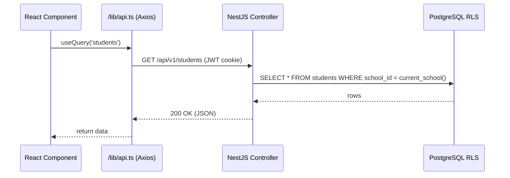

# School Management System

## Development Standards & Integration Guide

> **One source of truth for every team in this mono‑repo – Next.js frontend · NestJS backend · PostgreSQL.**
> Keep this file handy; every pull‑request is checked against it.

---

## 1 · System At‑a‑Glance

| Layer          | Stack & Tooling                                                                   |
| -------------- | --------------------------------------------------------------------------------- |
| **Frontend**   | Next.js 15 · React · TypeScript · TailwindCSS · shadcn/ui · React Query · Zustand |
| **Backend**    | NestJS · TypeORM · PostgreSQL · JWT + RBAC · Swagger/OpenAPI                      |
| **Database**   | PostgreSQL with Row‑Level Security (RLS) using `schoolId`                         |
| **Deployment** | Docker multi‑stage → Helm/K8s (dev, staging, prod)                                |

---

## 2 · Current Integration Status

| Area             | Convention                                                      |             Status             |
| ---------------- | --------------------------------------------------------------- | :----------------------------: |
| **API Base URL** | `.env`: `VITE_API_BASE_URL` (FE), `BACKEND_PUBLIC_URL` (BE)     |                ✅               |
| **HTTP Client**  | `/lib/api.ts` Axios wrapper, automatic token refresh            |                ✅               |
| **Auth Flow**    | JWT (access + refresh) in **httpOnly cookies**                  | ⏳ (uses `localStorage` in dev) |
| **Endpoints**    | Plural, kebab‑case, versioned (`/api/v1/grades`)                |                ✅               |
| **CORS**         | BE whitelist from `FRONTEND_URL`; dev allows `localhost:*`      |                ✅               |
| **Error Model**  | `{ statusCode; message; error }` – mirrors Nest `HttpException` |                ✅               |

 Completed • In‑Progress • Pending Matrix 

### ✅ Completed

* Multi‑tenant RLS backend modules (Users, Classes, Grades…)
* Swagger docs & Storybook UI library
* Axios service layer & typed DTOs

### 🔄 In Progress

* Cookie‑based auth (replacing `localStorage`)
* End‑to‑end multi‑tenant test suite

### ⏳ Pending

* WebSocket live updates (attendance / grades)
* Advanced analytics dashboard
* File upload & notifications

---

## 3 · Engineering Principles

| Principle             | Practice                        |
| --------------------- | ------------------------------- |
| **Readable > Clever** | Clear names, no magic values.   |
| **Fail Fast**         | Throw typed errors immediately. |
| **Single Source**     | Shared types & env helpers.     |
| **100 ms Rule**       | Queue/cache slow work.          |
| **Tests = Code**      | Same review bar.                |

---

## 4 · Code Standards

### 4.1 TypeScript (both sides)

* `strict: true` – avoid `any`.
* Use `enum` / `as const` for literals.
* DTOs live in `/modules/<feature>/dto`.
* Absolute imports via `@/`.

### 4.2 Backend (NestJS)

* Controllers are thin; services hold logic.
* Global `ValidationPipe({ whitelist: true, forbidNonWhitelisted: true })`.
* All DB access via `TenantAwareRepository<T>`.
* Swagger decorators on every route & DTO.

### 4.3 Frontend (Next.js)

* Functional components + hooks only.
* React Query for server state; Zustand for UI state.
* TailwindCSS theme tokens; no inline styles.
* API calls **only** through `/lib/api.ts`.

---

## 5 · Git & CI Pipeline

1. **Branch**: `feat/…`, `fix/…`, `chore/…`.
2. **Commits**: Conventional Commits (`feat(auth): refresh‑token route`).
3. **PR Checklist**

   * ✅ Lint & Prettier pass
   * ✅ Unit + integration tests green, coverage ≥ 80 %
   * ✅ Swagger/Storybook updated
   * ✅ Ticket linked
4. **CI**: GitHub Actions – lint → test → build → deploy (staging/prod).

---

## 6 · Frontend ⇄ Backend Workflow

---

## 7 · Adding a New Feature (Checklist)

1. **Backend**

   * `nest g resource modules/books`
   * DTOs + Swagger
   * PG migration (`npm run typeorm:generate`)
2. **Frontend**

   * Types in `/types/api.d.ts`
   * React Query hooks in `/lib/api/books.ts`
   * Components/pages under `/features/books/*`
3. **Tests**

   * Jest unit tests
   * Supertest e2e (`/test/books.e2e-spec.ts`)
   * Playwright happy‑path
4. **Docs**

   * OpenAPI schema & Storybook

---

## 8 · Testing Matrix

| Layer       | Tool             | Goal                               |
| ----------- | ---------------- | ---------------------------------- |
| Unit        | Jest             | 100 % of core logic                |
| Integration | Supertest + Jest | Validate HTTP contracts            |
| E2E         | Playwright       | User flows in Docker‑compose stack |

---

## 9 · Environments & Deployment

| Env     | FE URL             | BE URL                 | Notes                      |
| ------- | ------------------ | ---------------------- | -------------------------- |
| Dev     | `localhost:3000`   | `localhost:4000`       | Hot reload                 |
| Staging | `staging.<domain>` | `api-staging.<domain>` | Auto‑deploy from `develop` |
| Prod    | `<domain>`         | `api.<domain>`         | Manual promote             |

Docker → container registry → Helm chart → K8s.

---

## 10 · Security Essentials

* 🔑 Secrets in Doppler (not repo).
* 🛡️ Helmet, rate‑limiter (`100 req / 15 min / IP`).
* 🧼 `class-validator` & `class-transformer` on input.
* 📦 Snyk + Dependabot alerts.

---

## 11 · Glossary

| Term               | Description                           |
| ------------------ | ------------------------------------- |
| **School**         | Tenant isolated by `schoolId`.        |
| **Class**          | Cohort within a school.               |
| **SubjectTeacher** | Mapping of Teacher ↔ Subject ↔ Class. |
| **Grade**          | Numeric score (0–100).                |
| **Attendance**     | Daily presence per class.             |

---

**Last updated:** {{DATE}}
